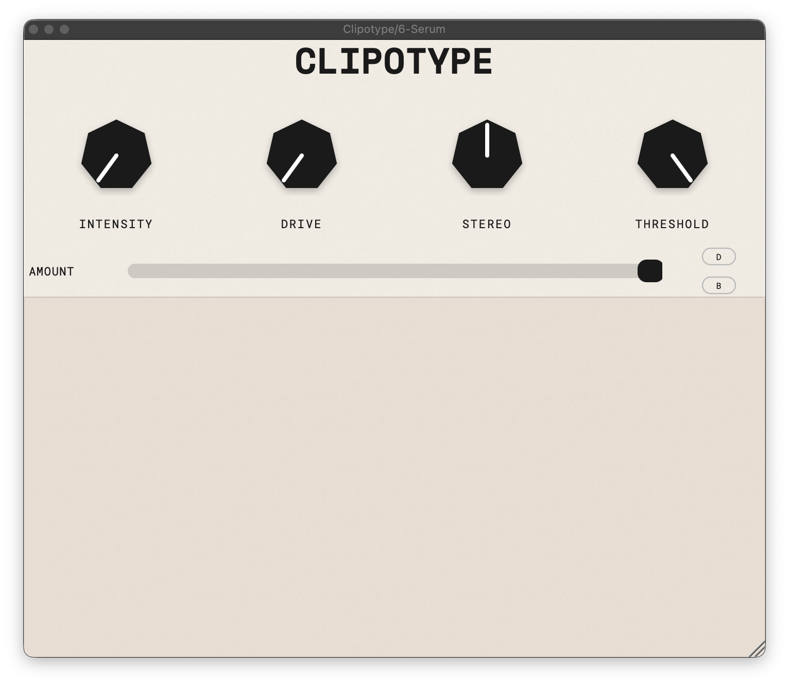
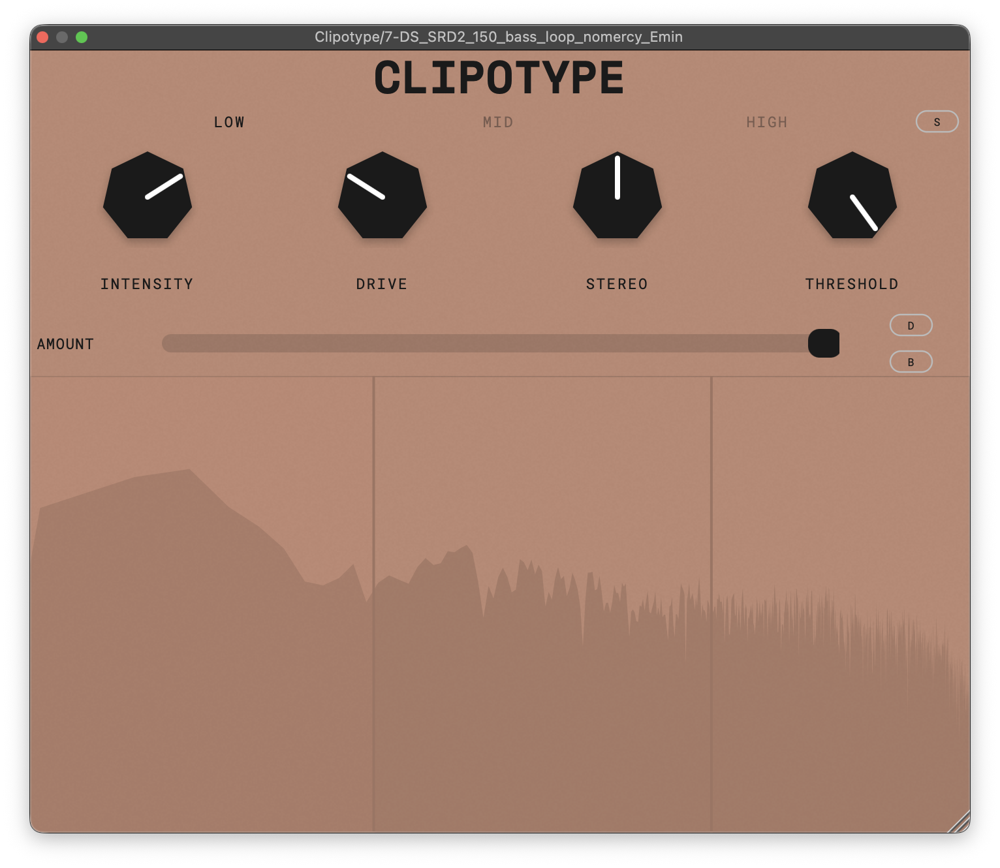
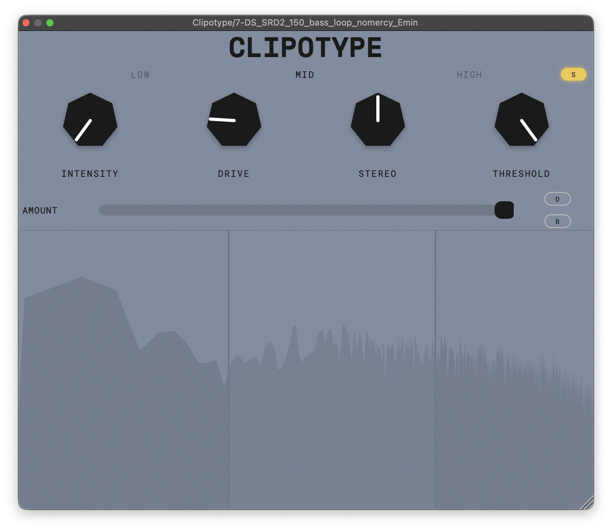

# Clipotype

A multiband saturator / clipper plugin built with JUCE. Clipotype allows you to visually split your audio spectrum into three distinct frequency bands and apply different flavors of saturation and waveshaping to each band independently.

## Control & Parameters
-Intensity button let you select the type of clipping that happens zero percent intensity means you are soft clipping the sound as you go up to one hundred percent clipping happens harder.  
-Drive knob let you choose how much saturation that effect your sound.  
-Stereo knob let you add width to your sound you can also make your mono by choose it zero percent.  
-Threshold knob let you determine which db and above loudness signals that effect from saturation.  
-Amount let you select how much of the processed sound gets out of the clipper zero percent means sound signal leaves the plugin with no effects on it.  
-With delta knob you can only listen what clipotype adds to your sound and with the bypass knob you can listen your input sound.  
-In the spectrum analyzer you can see your sound spectrum you can split the frequencies up to three band and by the band section thats above you can add different type of saturation to different bands.

## Features
- 1-3 frequency bands with draggable crossover points
- Per-band Intensity (soft-to-hard waveshaping morph), Drive, and M/S stereo width
- 4x oversampling
- Real-time spectrum analyzer
- VST3 / AU / Standalone

## Screenshots

  
  

## Building
Requires JUCE 8 and CMake 3.22+.

## License
AGPLv3

## Installation

Download the latest version from the [Releases](https://github.com/mustafamazi/Clipotype/releases) page.

### macOS
**Requirements:** macOS 11 or later (Apple Silicon and Intel)

1. Open `Clipotype-v1.1-macOS.pkg` and follow the installer.
2. Choose which formats to install (VST3, AU, Standalone). The installer places them in:
   - VST3: `/Library/Audio/Plug-Ins/VST3`
   - AU: `/Library/Audio/Plug-Ins/Components`
   - Standalone: `/Applications`
3. Restart your DAW or rescan plug-ins.

The installer is signed and notarized by Apple.

### Windows
**Requirements:** Windows 10 or 11 (64-bit)

1. Unzip `Clipotype-v1.1-Windows.zip`.
2. Copy the `Clipotype.vst3` folder to `C:\Program Files\Common Files\VST3`.
3. Restart your DAW or rescan plug-ins.

If Windows SmartScreen shows a warning when opening the standalone app, click **More info → Run anyway**.

### Uninstall
Delete the files from the locations listed above.
